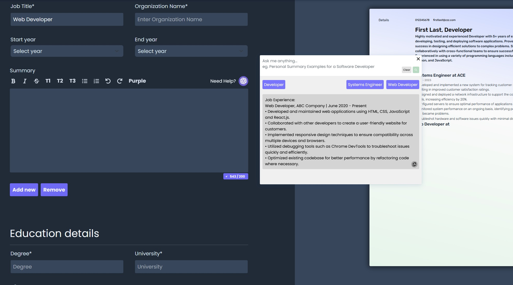
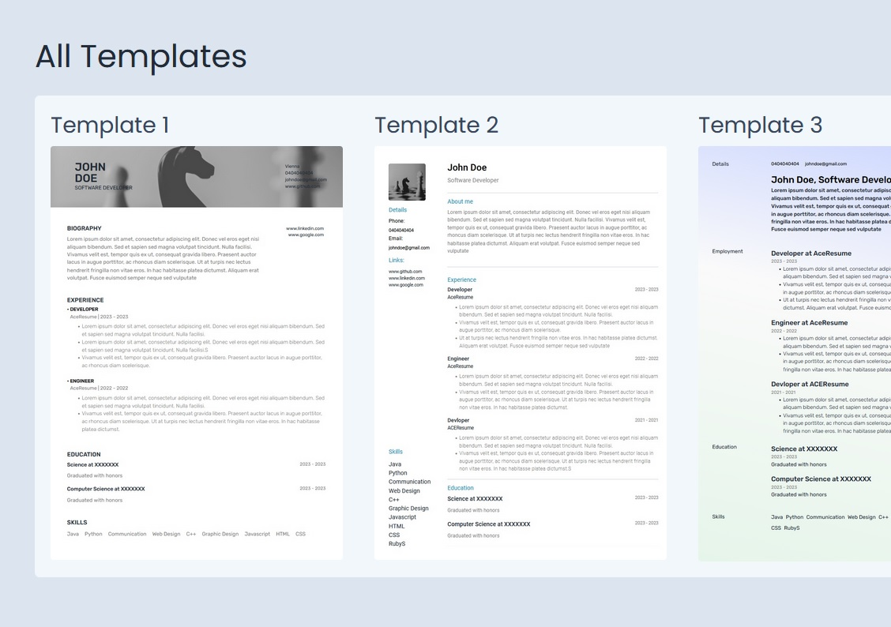
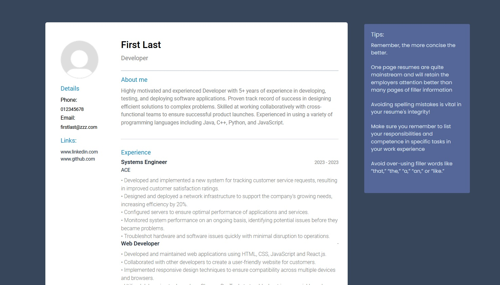

# Ace-Resume
Build with ReactJS

Features:
- Switch between templates
- Autofilling preview
- Export to PDF
- Chat GPT Autofill recommendations
- Tips, word count, writing recommendations

What I seek to add:
- Smart Resume AI tools like resume score
- Color picker
- User accounts to save their resumes
- Export to WordDocx

This app is yet to be deployed, however it will be soon!
